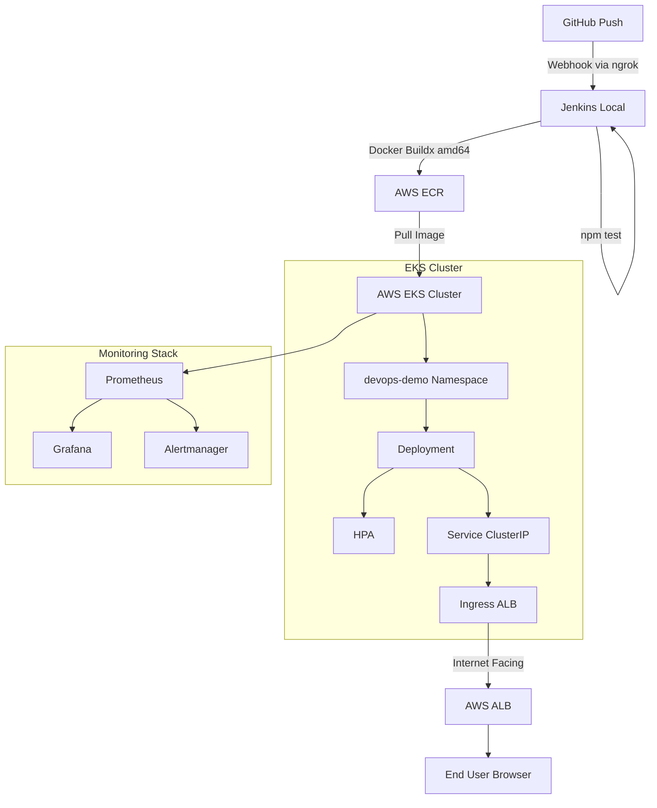

# End-to-End DevOps Pipeline: Node.js on AWS EKS

A professional, production-ready CI/CD pipeline demonstrating the deployment of a Dockerized Node.js API to an Amazon EKS cluster. This project showcases the integration of Infrastructure as Code (IaC), automated CI/CD orchestration, cloud-native networking, and full-stack observability.

## 🚀 Project Overview

This project implements a complete DevOps lifecycle: from code commit to a monitored production environment. It leverages **Terraform** for infrastructure provisioning, **Jenkins** for CI/CD orchestration, **Amazon EKS** for container orchestration, and the **Prometheus/Grafana** stack for real-time monitoring.

### Key Features
- **Infrastructure as Code (IaC):** Fully automated AWS environment setup using Terraform modules.
- **Automated CI/CD:** Jenkins pipeline handling testing, multi-platform Docker builds, and EKS deployment.
- **Cloud-Native Networking:** External access via AWS Load Balancer Controller and ALB Ingress.
- **Auto-Scaling:** Implementation of Horizontal Pod Autoscaler (HPA) for dynamic scaling.
- **Full-Stack Observability:** Integrated Prometheus and Grafana dashboards for cluster and application health.
- **Cost Optimization:** Use of AWS Spot Instances and a dedicated teardown strategy.

---

## 🛠 Tech Stack

| Category | Tools Used |
| :--- | :--- |
| **Cloud Provider** | AWS (EKS, ECR, VPC, IAM, ALB) |
| **Infrastructure** | Terraform |
| **CI/CD** | Jenkins, GitHub Webhooks, ngrok |
| **Containerization** | Docker, Docker Buildx |
| **Orchestration** | Kubernetes (EKS), Helm |
| **Monitoring** | Prometheus, Grafana, Alertmanager |
| **Application** | Node.js, Express |

---

## 📐 Architecture



*(Note: If Mermaid is not rendered, the flow is: GitHub $\rightarrow$ Jenkins $\rightarrow$ ECR $\rightarrow$ EKS $\rightarrow$ ALB $\rightarrow$ User, with a parallel Monitoring stack observing EKS).*

---

## 📂 Repository Structure

```text
devops-eks-cicd-pipeline/
├── app/                    # Node.js/Express Task API source code
├── terraform/              # IaC definitions
│   ├── modules/            # Reusable modules (vpc, eks, ecr)
│   └── environments/dev/   # Environment-specific configurations
├── jenkins/                # CI/CD pipeline definitions
│   ├── Jenkinsfile         # Pipeline-as-Code
│   └── setup-ngrok.md      # Guide for local Jenkins exposure
├── k8s/                    # Kubernetes manifests (Deployment, Service, HPA, Ingress)
├── monitoring/             # Helm values and alert rules for Prometheus/Grafana
├── scripts/                # Utility scripts (bootstrap, budget-alerts, teardown)
└── docs/screenshots/       # Project verification captures
```

---

## 🏁 Getting Started

### Prerequisites
Ensure the following tools are installed on your local machine:
- `kubectl`, `awscli`, `helm`, `eksctl`, `ngrok`
- **Docker Desktop** (with Buildx enabled)
- AWS Account with appropriate IAM permissions (EKS, EC2, IAM, ECR, ELB)

```bash
# Configure AWS CLI
aws configure
```

### Step 1: Provision Infrastructure
1. **Initialize Backend:**
   ```bash
   chmod +x scripts/bootstrap-backend.sh
   ./scripts/bootstrap-backend.sh <your-unique-bucket-name> ap-south-1
   ```
   *Update `terraform/environments/dev/backend.tf` with your bucket name.*

2. **Apply Terraform:**
   ```bash
   cd terraform/environments/dev
   terraform init
   terraform apply -auto-approve
   ```
   *Note the `vpc_id`, `ecr_repository_url`, and `eks_cluster_name` from the output.*

### Step 2: Cluster Configuration
Connect your local `kubectl` to the new EKS cluster:
```bash
aws eks update-kubeconfig --region ap-south-1 --name devops-eks-cicd-dev-eks
kubectl get nodes # Verify nodes are Ready
```

### Step 3: CI/CD Setup (Jenkins)
1. **Run Jenkins:**
   ```bash
   docker run -d --name jenkins -p 8080:8080 -p 50000:50000 \
     -v jenkins_home:/var/jenkins_home \
     -v /var/run/docker.sock:/var/run/docker.sock \
     jenkins/jenkins:lts
   ```
2. **Install Tools in Jenkins:**
   Execute the following inside the container to enable `awscli` and `kubectl`:
   ```bash
   docker exec -u root -it jenkins bash
   apt-get update && apt-get install -y docker.io awscli
   curl -LO "https://dl.k8s.io/release/v1.29.0/bin/linux/amd64/kubectl"
   mv kubectl /usr/local/bin/ && chmod +x /usr/local/bin/kubectl
   exit
   docker restart jenkins
   ```
3. **Expose via ngrok:**
   Follow `jenkins/setup-ngrok.md` to create a tunnel and configure the GitHub Webhook.

### Step 4: Pipeline Execution
1. Configure the Jenkins Pipeline job using `jenkins/Jenkinsfile`.
2. Add credentials: `ecr-repo-url` (Secret text) and AWS Access Keys.
3. Trigger the pipeline via a Git push:
   ```bash
   git add . && git commit -m "deploy" && git push
   ```

---

## 🌐 Networking & Ingress

To enable external access via an AWS Application Load Balancer (ALB), the **AWS Load Balancer Controller** must be installed.

1. **IAM Setup:**
   ```bash
   curl -o iam-policy-latest.json https://raw.githubusercontent.com/kubernetes-sigs/aws-load-balancer-controller/main/docs/install/iam_policy.json
   aws iam create-policy --policy-name AWSLoadBalancerControllerIAMPolicy --policy-document file://iam-policy-latest.json
   ```
2. **IRSA Configuration:**
   ```bash
   eksctl utils associate-iam-oidc-provider --region ap-south-1 --cluster devops-eks-cicd-dev-eks --approve
   eksctl create iamserviceaccount \
     --cluster devops-eks-cicd-dev-eks \
     --namespace kube-system \
     --name aws-load-balancer-controller \
     --role-name AmazonEKSLoadBalancerControllerRole \
     --attach-policy-arn arn:aws:iam::<ACCOUNT_ID>:policy/AWSLoadBalancerControllerIAMPolicy \
     --approve --region ap-south-1
   ```
3. **Helm Installation:**
   ```bash
   helm install aws-load-balancer-controller eks/aws-load-balancer-controller \
     -n kube-system \
     --set clusterName=devops-eks-cicd-dev-eks \
     --set serviceAccount.create=false \
     --set serviceAccount.name=aws-load-balancer-controller \
     --set region=ap-south-1 \
     --set vpcId=<YOUR_VPC_ID>
   ```

---

## 📊 Observability

The monitoring stack is deployed using the `kube-prometheus-stack` Helm chart.

```bash
helm install monitoring prometheus-community/kube-prometheus-stack \
  -n monitoring --create-namespace -f monitoring/prometheus-values.yaml
kubectl apply -f monitoring/alerts.yaml
```

**Accessing Grafana:**
```bash
kubectl port-forward -n monitoring svc/monitoring-grafana 3000:80
```
*Login: `admin` | Password: Retrieve via `kubectl get secret`.*

---

## 🧠 Technical Challenges & Solutions

| Challenge | Root Cause | Engineering Solution |
| :--- | :--- | :--- |
| **npm ci EACCES Error** | Cache corruption due to mixed root/user execution in Jenkins. | Implemented isolated workspace cache: `npm ci --cache .npm-cache`. |
| **Deployment Timeout** | Image architecture mismatch (Apple Silicon `arm64` vs EKS `amd64`). | Utilized `docker buildx build --platform linux/amd64` for cross-platform compatibility. |
| **Groovy Secret Warning** | Secret interpolation in double-quoted Groovy strings. | Switched to single-quoted heredocs (`sh '''...'''`) to delegate expansion to the shell. |
| **Blank Ingress Address** | Missing AWS Load Balancer Controller. | Deployed Controller via IRSA and Helm to manage ALB lifecycle. |
| **Controller VPC Lookup Failure** | IMDS (Instance Metadata Service) unreachable by pod. | Explicitly passed `vpcId` during Helm installation. |
| **Controller AccessDenied** | IAM policy version mismatch with newer controller. | Updated IAM policy using the latest definition from the `main` branch. |
| **Grafana Connection Refused** | Attempting to use `localhost` for internal cluster communication. | Configured Prometheus data source using Cluster-DNS: `monitoring-kube-prometheus-prometheus.monitoring:9090`. |
| **Port Conflict (3000/9090)** | Stray local Docker containers squatting on ports. | Implemented port auditing via `lsof -i` and `docker ps` before port-forwarding. |

---

## 🗑 Teardown

To avoid ongoing AWS costs, execute the teardown script:
```bash
chmod +x scripts/teardown.sh
./scripts/teardown.sh
```
*This removes all K8s resources, Helm releases, and destroys the Terraform-managed infrastructure.*

---

## 🖼 Verification

| Component | Evidence | Status |
| :--- | :--- | :---: |
| **Ingress** | `docs/screenshots/ingress-address.png` | ✅ |
| **Monitoring** | `docs/screenshots/grafana-dashboard.png` | ✅ |
| **CI/CD** | `docs/screenshots/jenkins-pipeline-success.png` | ✅ |
| **Application** | `docs/screenshots/app-response.png` | ✅ |
| **Prometheus** | `docs/screenshots/prometheus-targets.png` | ❌ |
